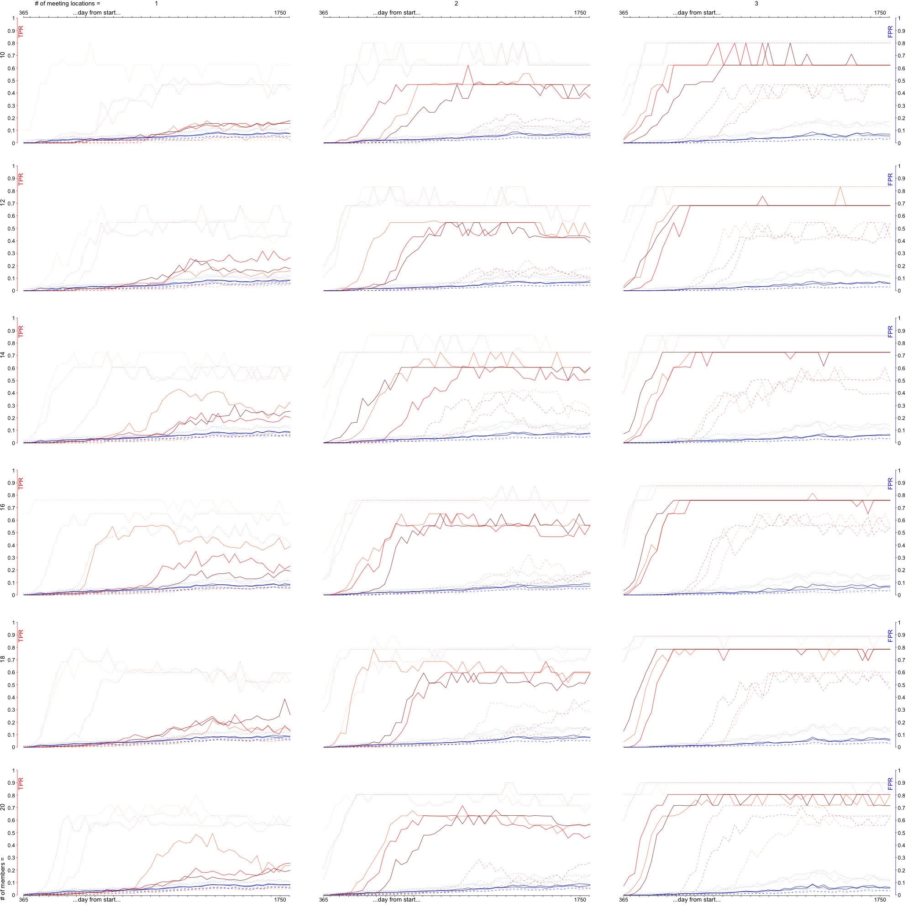

##Abstract

Implicit in the label *dark network* is a suggestion that the activity of covert
groups is driven by - and therefore, may be understood in terms of - network
measures like degree distributions, paths, centralities, and so on.

That may be true in some cases, but the central assumption of network analyses,
that the represented entities and interactions are of a small set of formal
types, has limited empirical basis for covert groups.  Therefore, we should be
skeptical of applying network-based techniques to modeling and detection of covert groups.

If we wish to more confidently use network-based analysis, we should ground the
performance of those techniques against more detailed models of underlying
phenomena. These detailed models suffer from a knowledge problem as well, but we
may reason about them in a more principled way and may consider many alternative
scenarios.  With these guesses about the underlying mechanisms, we can simulate
activity and then project observations of that activity into a network
representation for analysis.

We demonstrate such an approach by augmenting an empirical dataset: we embed
synthetic covert groups in a real general population dataset.  We discuss the
results and implications for naive application of social network analyses to
covert groups.

* * *

##Introduction

Some network science approaches to social phenomena emphasize searching for
statistically significant differences between well-defined populations or scenarios on
convenient mathematical metrics - *e.g.*, degree distributions, path lengths, centrality
measures.

Network models usually make strong assumptions - that the things we represent as
vertices are formally all of a small set of the same *kind* of thing (often a
single kind), and that the interactions between them are likewise drawn from a
few or one type category. Such assumptions can be reasonable, and when they are,
compact descriptions can usefully cover a broad array of phenomena, and seeking
these pure network statistics can be a useful exercise.  Indeed, this is largely
the basis for the success of [mathematics in the physical sciences][wigner1960unreasonable],
whether one subscribes to scientific realist or instrumentalist philosophies.

The natural and social sciences, however, consider phenomena more sensitive to
context and variation. For those phenomena, lumping elements into the same
categorical types can be an unreliable assumption.

One such questionable application is *dark networks*, the social network
representation of covert groups, which are often used as a means to model
criminal organizations, and then predict which individuals make the best
subjects for close observation or intervention.  By focusing on the network
reduction of these groups and associated network metrics, we may forget that the
network is a convenient representation and is not in fact the what actually
happens or how it is observed.  Even the aspects which have obvious translations
into network representations (*e.g.*, who knows whom) and have well-established
options for data-gathering (*e.g.*, various respondent-driven sampling
techniques) may be problematic for certain classes of covert networks.  These
methods may make [reasonable in-roads][salganik2004sampling] for consumers and
distributors of illegal substances or persons with persecuted sexual preferences
or disease status, but the techniques required for successful respondent-driven
sampling are impractical for academics studying violent terrorist organizations
or state espionage apparati.  In some cases, these groups may even be structured
in a way - high compartmentalization, with multiple layers of indirection, high
probability of failing to refer - such that fundamental assumptions from
conventional methods about the relationship structure are violated.

Rather, the actual phenomena are the interactions between and individual changes
in the members of a covert enterprise over the life of that collaboration, and
the effect those have internal and external to that organization.  Indeed,
events of diverse types involving multiple individuals (and sometimes
individuals) are the observations we actually make - not some network - and the
outcomes we actually care to understand.  Further complicating a treatment of
covert groups is the fact that these groups exist as foreground alongside a
background population, with the populations largely indistinguishable.  All of
those concerns imply that mis-prediction by overzealous application of network
analysis could lead to erroneous action, and assorted negative consequences,
*e.g.* waste of resources, failure to counter threats, creation of new threats
via mis-identified individuals.

We should expect that representing covert groups by a concise set of equations
is an implausible task.  Thus, we propose that such mathematical models,
including the integro-differential, discrete difference, and network dynamic variety, are not especially
useful for formal representation of the dynamics of covert groups.  Rather, concise *programmatic* models are a basis for useful and practical
representation. This is the position of most agent-based model enthusiasts, but
we are further advocating adaptation of some ideas and methods from software
engineering to the modeling of dynamics of covert groups.  In particular, we
emphasize thinking about behaviors as a modular, composable, and re-useable language
within agent-based models.  We reiterate some insights from the software engineering
discipline on how to proceed in creating entities in such a language, and
discuss how these practices relate to, and are more advantageous than traditional equation-based models.

We motivate this comparison of the *dark group* versus *dark network* approaches, with a large empirical
dataset and its interpretations, using shorthand like *the Montreal data* or
*the Montreal network*.  We ultimately frame a *dark network* analysis - community
detection - in terms of micro-simulation of the *dark group* augmenting this
dataset.

For longer notes, we will embrace an aside format as follows:

> ## The Montreal Municipal WiFi Service Data & A Basic Model
>
> In a [forthcoming publication][montreal], epidemiological modelers use data on
access to the Montreal Municipal WiFi service to build a contact network and
then consider the spread of flu-like pathogens on that network.  That work
focuses on a theoretical epidemiological question - whether or not a unique
network structure could explain a specific kind of epidemic dynamic.  The
relationship between the data and the network model, however, is ideal for
exploring many of the issues present in attempting to analyze covert social
groups with dark network representations.
>
> The anonymized raw data is straightforward to understand.  Users have log on
and log off times at WiFi hotspots associated with the service.  How the data
are translated into a network for the epidemiological analysis is also simple:
users that logged into the same location at the same time are joined by an edge.
Those edges are then aggregated into a contact network, removing duplicates and
self loops.
>
> However, the raw data can also be represented exactly as a time-sensitive
(based on login-logout pairs), bipartite (person-to-hotspot) graph.
>
>The data spans roughly five years.  It contains a few hundred thousand entries
of login data with around 200k users and roughly 350 hotspot locations.

## Behind Network Modeling

[Snijders *et al.*][Snijders201044] provide an outline of stochastic simulation
of social networks using agent-based models.  They advocate for this perspective
as a useful approach to longitudinal data, and they explicitly commit to the
network representation and to expressing dynamics in terms of network features.

However, we think it is premature when initiating covert group representations
and detection strategies to think in terms of, *e.g.*, triadic closures rates
instead of making marriage arrangements for acquaintances.  We propose that the
transient *events* (*e.g.*, individuals meet), *state changes* (*e.g.*, an
individual gains or expends money), and *observation* process of how those are
recorded (*e.g.*, people record transactions at particular locations at
overlapping times) are precisely what we should focus on modeling.

This is not to discount the value of network science techniques.  We suggest
that instead one must be cautious in their application when there is not a very
complete, clear, and uniform translation of observed phenomena into a network,
because those are the implicit assumptions of most network analyses.  One way to
take that caution is to step back into the messier details - the events, states,
and their observations - and simulate those as a ground truth.  When we do that,
we must clearly state the ways we believe the system might work.  We may take
those simulation results, and then translate them into networks.  To
accomplish that, we must clearly state how we believe our observations relate to
the real phenomena and how we aggregate our observations into reduced measures.
Finally, we may perform our network science analyses and compare those results
to the simulation inputs where we know truth (*model* truth, that is).

In a very loose sense, we are performing a Bayesian analysis by integrating over
our priors (the space of our plausible individual models) to characterize our
confidence in the outcome of some network-based metric.

Implementing an agent-based simulation in this mode can be quite intuitive.  The
events and state changes should correspond to phenomena we could observe, and
likely do observe, if perhaps not very easily for the covert members.  We have a
long history of models of such individual and small-group behavior, even if
perhaps those are simply story-telling models. Likewise, we can engage
critically with an explicitly modeled observation process.

> ### What is happening in the Montreal Data?
>
> The Montreal dataset comprises entries of unique user id login and logout
times to the publicly provisioned wifi system at a unique hotspot hardware id.
>
> We could very easily flatten this dataset into a time-aggregated,
person-to-person network and then perform some network-based analysis.  This is
precisely what the initial purveyors of the data did.
>
> Instead, we choose to view the data not as a network, but as the series of
events they represent, that *might* be able to inform us about a particular
group.  To do this we have to model what the data mean.  For example, we could
work backwards:
>
> - people near enough to some physical location take action to access the wifi
system; how often do they login if they are at that location?  how often does
the login represent that person being within the location?
> - people go to that location; are they going to meet particular other people?
if they are going to meet other people versus for some product or service, does that influence their use of the hotspot?
> - people with relationships (*e.g.*, friendship, work collaboration) interact
in a way correlated with that relationship; how often does that interaction manifest
as going to locations like those with the municipal wifi service?  likewise, people
go places for individual purposes as well; what is that behavior like?
> - locations adopt or leave the municipal wifi service; how do they decide to do so?
> - businesses open and close, and people join and leave the municipal population; what do
those turnover rates look like?

Thinking about what a dataset means and how it came to be gives us a potential
model to reproduce these events.  Some of the model components probably look
like traditional network descriptions (people that work together, what locations
a person likes to visit), but many may not.  Those that do correspond to network
relationships might be unlikely to manifest in the available data - *e.g.*, in
the case of the Montreal data, ignoring your boss while out together for coffee
to check your email might be unwise.

In Snijders *et al*, this mechanically-oriented aspect appears in an objective
function, framed in terms of network change events as determined by current
network and individual traits.  Their overall perspective is about model
selection (which objective function to use) and parameter fitting (what values
for the coefficients in the objective function).  Our emphasis differs - we want
to build some practical sensitivities and confidence about various approaches - but model selection and parameter fitting are just as
possible using, *e.g.*, [Approximate Bayesian Computation (ABC)][toni2009approximate]
and [Partial Least Squares (PLS)][geladi1986partial] for exploring and characterizing parameter space.  Indeed, that
would be a reasonable approach to trying to reproduce the features of the Montreal
data itself.

One final thought on the general advantage of our approach in the context of
covert groups.  In this work, we focus explicitly on the *explanatory* aspect of
science.  Alone, that is not sufficient to be science: we must also commit to
predict and test, or if applying our results, we must intervene and monitor the
consequences.  Those interventions may have a clearer translation to a
non-network perspective.  For example, if the intervention is to interfere with
financial transactions, presumably an individual then has less money to use and
that can be captured in an existing resource accumulation and expenditure model.
It is less clear what that means in terms of a model that is only about the
creation and destruction of ties - does it mean eliminating particular ties or
tie types given less money to distribute?  Does it mean more ties or more
diverse ties as the individual ramps up work to get money?

## Modeling in Code

It may appear daunting to model agents in terms of many potentially interacting
behaviors.  Not just as a theoretical matter, but as a practical one - there is
little by way of easily accessible and reusable behavior libraries to mix into
agents. Many of the agent-based frameworks could potentially support behavior
libraries, but the sort of large, well-advertised scientific package repositories and
development communities (*e.g.*, [\"CRAN\"][cran] for R) has yet to emerge.
However, there is substantial value to be had if something akin to that did appear.

If we are especially careful in our implementations of these models, we can
isolate particular aspects, and then reuse them.  We might have, for example,
agents that perform arbitrage.  That implementation, carefully abstracted, might
be portable from an initial context of stock market actors to criminals dealing
in black market goods.  Clearly, the inputs are different, but if we believe the
core mechanisms are the same, then we ought to implement it once and then reuse
that element.  This has dual advantages. There is the practical matter of having
more thoroughly vetted models faster. The second is that re-use could gradually
smooth the abstraction into what is actually conserved across those domains, and
further highlight what differs between contexts.

This general trajectory would also make agent-based modeling begin to look
a lot more like what happens in the software engineering community, and in
particular quite a bit like the videogame industry.  Particular behaviors and
recurring situations in software are isolated into re-usable objects and design
patterns.  While a game like, say, \"The Sims\" might not be useful as a
scientific model, the underlying implementation may provide substantially more
practical insight than traditional numerical models.

Certainly, our ambitions with any particular agent-based model are narrower than a massive
entertainment franchise.  We must formally specify a practical model that can
produce the kind of data we have.  At marginally less coarse level, we need a
description of the actors (agents) over time, their interactions, how those interactions
are recorded as the events comparable to our data.  We should start with an anecdotal, natural language
description, which must then be translated into exact syntax.  Traditionally,
that has been equation-based mathematics, but a computer program can also be exact.

Good equation-based models have some recognizable features, like parameter
choices that elucidate mechanics, consistency with typical domain labeling, and
forms that are easily computable.  Indeed, these models often continue to parse
very closely to a reasonable natural language description.  For some phenomena and levels of realism, however, the equation-based expressions
become too convoluted or arcane.  This is where an approach like agent-based modeling
becomes the appropriate exact abstraction.  Those features of traditional models remain desirable, however.
This sort of programming was initially described by Knuth as [\"literate programming\"][knuth1984literate],
and essentially aims to achieve code that is as close to a natural language story
as practical.  The intent being that people who were algorithmically inclined -
scientists, engineers, mathematicians - would be able to comprehend what the
program represented without having to be expert in the hard syntax constraints.
For more complex programs, the more complex code required can be enhanced for
these lay readers by adopting [test-driven design (TDD)][janzen2005test] practices.  The test code
can then communicate additional essential perspective on what various pieces are *meant* to
do.  

Taking a test-driven development approach is also consistent with approaches
to science such as the [method of decreasing abstraction][lindenberg1992method] or the iterated modeling
approaches [advocated for ecological systems][koopman].  Test driven design
encourages incremental development of narrow, independent behaviors, and as new
behavior added to a module, or modules integrated, that test infrastructure can
be used to verify that the components still obeys constraints and context expressed by tests.
Though less pertinent for software engineering, for simulation code we might also
reasonably include statistical performance against particular datasets as part
of the test criteria.

Finally, for commonly recurring problems, adopting generic solution
templates - typically called [design patterns][gofbook] -
can do for a program what tropes do for television: provide huge context with compact
shorthand.  Though we do not delve into the details, the implementation we provide
shortly embraces several of these patterns, most notably Chain of Responsibility and Strategy.

There have been several decades of trends driving these software engineering
practices, independent of any directed impetus to enhance agent-based modeling.
Initially, most general purpose languages reflected what actually occurred in
computer memory with the syntax improvements limited to abstractions for
convenient creation and manipulation of numerical types, and for flow control.
The [initial development][dahl1966simula] of object-oriented concepts -
essentially, thinking about programmatic representations in the way we think
about entities in the real world, as composition of how they respond to change,
their relationships to similar and dissimilar entities, *etc* and how to use that
kind of representation in succinct, formal ways - shifted how we
reasoned about programs, leading to languages and libraries designed for those
concepts (see [Stefik and Bobrow][stefik1985object] for some history).  Modern
programming languages bring even-more-natural language syntax while maintaining
the precision necessary to direct a computer.  We will demonstrate using this
approach for agent-based modeling using [Scala][scala] and the Actor library
developed by [Akka][akka].

## Aside: Augmenting Empirical Data

An easy approach to validating network-based covert group detection techniques
would be to take some empirical network, add a covert group network, and
then add some random connections between the two.  Remix a statistically satisfying
number of times, and presto, suitable subject for analysis?

Recall the Montreal data schema:

| user | location | log in time | log out time |
|:====:|:========:|============:|=============:|
| ABC  | 123      | mdy:hms     | mdy:hms + $\delta$ |
| etc  | etc      | etc         | etc |

Which exactly translates to a *time-dependent, bipartite network*.  If one collapses
on location, that would produce a *time-dependent, unipartite network*.
Then using a reasonable window, *e.g.* a day, one could aggregate events into a daily
time series of networks.

This is the way we will use the Montreal data, because this is comparable to
typical starting points for pure network analyses: an existing daily series for
an empirical social network, to which is added a similar, synthetic times series
of covert member network representations (also sourced elsewhere), and then testing
a detection scheme.  Instead of specific covert networks, we will be
simulating covert group interaction events instead.  A detailed review of that
data, which we can unfortunately not include in this publication due to data
release issues, would serve to further highlight why this agent-with-events approach is
preferrable.  There are many aspects of the dataset which indicate that
accepting the data as what it presents itself to be - the presence of people at
locations - is naive, but that an approach that discards outliers would also be
censoring valuable information.

Why data augmentation?  For starters, convenience - it eliminates the need to simulate
the background and guarantees realistic features.  It also encourages tailoring
approaches that are suitable to actual data that might be available for these
detection methods.  Finally, it is the nature of the particular groups that we
are looking to find that they are rare in the wild.  Thus, it is unlikely that one
is actually present in the data and would interfere with analysis.

When we augment the data with the covert groups, we impose a few additional
constraints.  The point of this analysis is to particularly characterize network
approaches when, presumably, those approaches are required.  If the covert group
were obviously distinct in some other fashion (bizarre login times, anomalously
frequent usage or location counts, *etc*.), then there would be no point to a specifically network-based
analysis and we should expect the results to be uninteresting anyway.  The
R script `investigate.R` in the source for this publication covers calculation
of ensuring that the covert members look like normal users in terms of
frequency of visits and number of locations visited.

## An Implementation

As discussed earlier, the Montreal data series is a time-sensitive, bipartite graph
derived from particular users accessing particular hotspots for particular times.
Our goal is characterize a detection scheme against a covert group generating that kind of data.

> ## Using the Montreal Data
>
> Recall that the Montreal data is unique users joining and leaving unique
hotspots, and that close examination of this data indicates there is regular
turnover (immigration and emigration) in users and locations.  For our model, we
will assume that the background actually has a constant number of actual
locations, and that turnover represents those locations adopting or quitting the
municipal service.
>
> For users, we assume that their turnover represents entering and leaving the
system.  Thus, the non-covert population depends on the window of the view.  We
might reasonably conclude that some changes represent identical users changing
authentication credentials.  However, for simplicity we ignore that possibility
in this model.

As such, our simulation agents will need to, as part of their routine, create similar
access records, both as a product of individual behavior and group membership.

The events generated by these agents will then need to be integrated with the
empirical dataset, flattened into a time series of unipartite networks, and
the community detection algorithm run against that time series.  The script for
launching supercomputer runs on a PBS-based system with Torque arrays enabled is
contained in the repository, `run.pbs`, and the community detection script is
`analyze.R`.  That code is largely bookkeeping commands, but the source for
the agents highlights our points about modeling-in-code.

We can start with their declaration:


Agent extends TimeSensitive with Travels[TravelData] with CSVLogger[TravelData]


and


Universe extends TimeSensitive with PoissonDraws with CSVLogger[TravelData]


which can be understood as *an Agent is time sensitive and travels*, the *Universe is time sensitive and uses
a Poisson process generator* and the whole simulation
records *travel data* to the csv format.  These illustrate some of the broad categories that
agent `trait`s could fall into:

 - simulation backbones, such time-based iteration
 - re-useable state and dependencies, such as location-visiting
 - output, such as recording data to csv files
 - mathematical utilities, such as probabilistic generators

The abstract implementation of these traits and then their explicit incorporation
in the simulation entities is worth examining.  We elide code that exists to
enable distributed simulation because it could be automatically generated and is
not informative about the modeling process.


trait TimeSensitive {
  // ...
  protected def _tick(when:Int) = when
}


Quite boring, right? It receives a time, and replies with that time.
Recall, however, that traits are meant to be consumed:


class AgentImpl(visProbPerTick: Probability, /*...*/) extends Agent {

  override def _tick(when:Int) = {
    if (!_traveled && (Math.random < visProbPerTick)) {
      // if I haven't already been directed to travel, I might randomly do so
      // ...
    } else {
      _clearTravel
    }
    super._tick(when)
  }
}


Here we provided agent behavior by extending the default behavior.  In
this particular case, we have intercepted the call, stochastically had
the agent visit a location, then returned to behavior defined elsewhere by
closing with `super._tick(when)`.

Using Scala traits, we can focus on exactly what we are modeling:
what the agent does relative to the passage of time in the simulation.  There
are only two lines devoted to the syntax requirements (the `override def ...`
and `super._tick(when)`) as compared to the content devoted to the model
mechanics.  We have also kept the details necessary to make this code functional
in an asynchronous setting (*e.g.*, in cluster computation) in the trait itself,
and out of the way of the researcher producing the simulation (and thus away
from inadvertent mistakes).  Finally, using a build tool (such as `sbt` or
`make`) or the developmental `macro` feature in Scala could reduce that
footprint even further, though we avoided these capabilities to best balance our
discussion of model choices and the gory details of model implementation.

If this agent had other traits that were also `TimeSensitive`, then the chain
of execution would simply continue on those until finally hitting the root trait.  For example,
we might want an agent that alters behavior with age, so we need a way of keeping
track of age:


trait Age extends TimeSensitive {

  private[this] var _age = 0
  def age = _age

  override def _tick(when:Int) = {
    _age += 1
    super._tick(when)
  }

}


This `agent.age` could then be used to, say, modify an agent's tendency visit places.

Researchers experienced with the aforementioned gory details of simulation will
have noticed by now that `Age` shows some of the weaknesses in our
`TimeSensitive` implementation, *e.g.* what happens if `agent.tick(when = 1)` is
called repeatedly?  An agent with `Age` would grow older by multiple increments,
despite actually being directed to respond to the same time-tick.

That sort of command is an easy error to make in an entirely local simulation,
so we ought to be addressing it purely from the standpoint of having simulation
components that highlight logical errors.  However, once we start simulating
agents on multiple nodes in a super-computer setting, it becomes a necessary
concern even if our simulation is error-free.

We have elected a simpler implementation to avoid distraction from other
points.  But the structure of our implementation - *i.e.*, in a `trait` with
a method that the adopting agent (and potentially other `trait`s of that agent)
links into a chain of execution - means that we can fix this problem in the `trait`.
With no changes to *scientific* meaning of this model, or other models re-using
this trait, we can \"upgrade\" this aspect to do that error handling.

With that introductory discussion covered, we will more succinctly introduce the
other traits we used in our particular implementation.


trait Travels[ResultType] {

  private[this] var traveled : Boolean = false
  def _traveled = traveled
  def _clearTravel = traveled = false

  def travelResult(location:Int, ts:TimeStamp) : ResultType

  // ...

  protected[this] def _travel(
    location: Int,
    ts: TimeStamp
  ) : ResultType = {
    traveled = true
    travelResult(location, ts)
  }

}


This provides for agents visiting locations at particular times, and tracks if
they have traveled \"recently\".  We use this for a simple agent state tracking
capability.  Note that state information can actually be encapsulated in the
trait - agents with this trait do not have to also implement tracking for their state.

These traits are sufficient to fully define our agent from a model perspective:


class AgentImpl(/* ... */) extends Agent {

  // ...

  override def travelResult(location: Int, ts: TimeStamp) = TravelData(-1, id, location, ts)

  override def _tick(when:Int) = {
    if (!_traveled && (Math.random < visProbPerTick)) {
      log( _travel( location = randomLocation, ts = randomHour ).copy( when = when ) )
    } else {
      _clearTravel
    }
    super._tick(when)
  }
}


The agent can be directed to travel, but if it has not, it randomly visits the
normal haunts at some stochastic rate.  In addition to the components of the
scientific model, there is also the algorithmic infrastructure in the
`CSVLogger` trait has desirable features.

That trait is written to be re-usable for any type of agent that might need to
record data, but it is also written in a way that a different sort of logger
(*e.g.*, SQL database) or different format (*e.g.*, JSON) could be written in an
analogous trait and the simulation could be re-run to write to a different data store by merely
changing the trait from `CSVLogger` to, say, `SQLogger`.

Finally, rather than use these agents directly in `main` method, we use a `Universe`
\"agent\".  In agent-based simulations, we have detailed agents inside some boundary
conditions.  Commonly, however, there are also exogenous forces that we need
to evolve as part of the simulation.  That is, the boundary is not a collection
of constants, but also an entity requiring updates as the simulation proceeds.
When a simulation calls for both micro-simulation (*i.e.,* the agents) and an
\"external\" macro-simulation, then having a `Universe` entity is an practical
representation.  Our `Universe` is:


class Universe(/* simulation parameters */)
  extends TimeSensitive with PoissonDraws with CSVLogger[TravelData] {

  // ...

  val agents : Seq[Agent]
    = Universe.createAgents(groupSize, locationCount, meetingLocations, avgLocs, visProb, fh)

  var daysToNextMeeting : Int = nextDraw()
    // initial days-to-next-covert meeting

  override def _tick(when:Int) = {

    if (daysToNextMeeting < 0) {
      daysToNextMeeting = nextDraw()
    } else {
      if (daysToNextMeeting == 0) { // time to meet
        val loc = shuffle(meetingLocations).apply(0)
        val ts = TimeStamp(nextInt(9)+8, nextInt(60), nextInt(60) )
        // choose place, time

        Await.result(
          Future.sequence(
            shuffle(agents).take(2).map( agent => agent.travel(loc, ts) )
            // randomly draw 2 agents to meet at a specific place, time
          ),
          400 millis
        ) foreach {
          res => log(res) // record results
        }

      }
      daysToNextMeeting -= 1
    }

    agents foreach { a => a.tick(when) }
    super._tick(when)
  }

}  


We use `Universe` as the root of the simulation, building the agents within
itself, running the state of the external world - specifically, how often the covert group
receives orders to meet - and handing off the `ticks` that drive the simulation.
There is also a final utility trait, `PoissonDraws`, which handles the
stochasticity for the external world:


trait PoissonDraws {

  val expectedK : Double

  lazy val poissonK : Iterator[Int] = DiscreteCountStats.poissonK(expectedK)

  def nextDraw : Int = poissonK.next()

}


This trait represents a particular strategy for choosing the duration between
meetings.  If we wanted to use a different distribution (*e.g.*, binomial or
exponential), then we could use a `Universe` with an alternative trait.

Using these agents, we can generated a synthetic time series of events to augment
the empirical data set based on a parameter sweep of meeting frequency, size of the
group, and number of meeting locations.  The details of that are available in
the `Demo.scala` file in the source directory.

## The Detection Test

For the community detection assessment, we take as a given that in the real
application one covert group member can be identified by independent means.  The
active group members are assumed to have equal probability of being caught.
This caught member in turn implicates the associated community.

Our approach applies a packaged community detection method (from the R package
[`igraph`][igraph], the `fastgreedy.community` method) designed for fast run
times against [large networks][clauset2004finding] without requiring criteria
like community number or size.  Briefly, this method is *agglomerative*: it
discovers communities by initially treating all vertices as separate
communities, then iteratively combining them based on the best change in
modularity (either great increase or least decrease). This continues until there
is only one community, which provides a process dendrogram.  That dendrogram is
then cut at the maximum modularity to choose the appropriate community division.

Other approaches rely on detecting particular network
signatures, which assumes accurate understanding of the organization structure
and how that structure is revealed via observation. That is not always a useful
assumption, and we opt to use a simpler scheme in our demonstration, but
certainly the agent-event based approach could be encoded with particular
organizational arrangements.

How should we think about this performance of this detection scheme?
Placing all of the covert group, and only members of that group, into a single
community is obviously ideal.  The complementary worst possible performance would be
dispersing one member into each different community.  The traditional True Positive Rate (TPR), or
sensitivity, and False Positive Rate ($FPR$), or non-specificity, are suitable
for this assessment, as our primary interests are how much of the group do we expect
to identify at any time, and how much of the background population will we mis-identify.
There are a variety of other statistics that can be derived from TPR and FPR, using
assorted complements and combinations, as well as measures like Receiver
Operating Characteristic (ROC) curves that we could derive if we had a tunable
detection methods.

Given communities, $i$, with covert and background populations for those
communities $(n_i, b_i)$, total populations $(n_t = \sum n_i, b_t = \sum b_i)$, and
our uniform probability of selecting any member as the initial member caught,
the probability of selecting community $i$ is $\frac{n_i}{n_t}$.  Once
selected, a particular community yields $\frac{n_i-1}{n_t - 1}$ as we are not
including our initially caught member in the $TPR$.  Therefore, the expected $TPR$ is

\begin{equation}
TPR = \frac{1}{n_t(n_t-1)}\sum_i n_i(n_i-1) \\
\end{equation}

Similarly, the expected FPR is

\begin{equation}
FPR = \frac{1}{n_t b_t}\sum_i n_i *b_i
\end{equation}

Since we have a time-dependent process, and in general we are interested in real
time detection, we should of course be interested in the time evolution of the
efficacy of detection.  This would provide us some qualitative insight on
trade-offs between risk of the covert group executing some goal, opportunity
cost (in terms of missed covert members), and downside (in terms of collateral
population implicated).  However, such subsequent meta-analysis like
these trade-off considerations is beyond the scope of this work.

## Results

<figure style="width:100%; margin:0">

<figcaption style="margin-top:1em">
Figure 1: this figure combines the three parameterization dimensions: number of
covert members (row dimension, smallest groups at the top, largest at the
bottom), number of covert meeting locations (column dimension, fewest to most
going left to right), and frequency of covert meetings (tint of lines, lightest
being most frequent to darkest least frequent).
 
The plotted lines are quartiles, the median as a solid line, 75% as dotted, and
25% as dashed.  The red lines are TPRs, the blues FPRs.
</figcaption>
</figure>

The results the subject community detection procedure, agglomerative greedy
modularity optimization, show startling differences across the underlying
parameters of covert group behavior.  The groups go from poorly detectable even
for long observation periods (top left - fewest meeting locations, smallest
group) to reliably detectable after a short monitoring period (bottom right -
most meeting locations, largest group).  Based on the change in order on ramp up
times for the different meeting frequencies, we can infer there is still
substantial noise in the medians, as should be expected given the limited sample
size ($n=100$) for each parameter combination.  This is somewhat contrary to
what might be our intuition about meeting frequency - more frequent covert
meetings seems like it should imply a higher information rate about that group.
While that seems to be mostly true of the series, it is not universally so.

The FPRs rather blandly march upwards (peaking around 10% for most cases, which
corresponds to around 10k individuals from the background population), but for
several parameter combinations, the TPRs form a distinct lump.  The implication
being that, with no evolution in group behavior, monitoring, at least with this
particular community detection strategy, can become *less* effective!

We suspect that this is another indicator of a strong need to be aware of what
the background data, which itself is changing over time, means. Near the end of
the time series, there appears to be an increasing trend in background user
turnover, which could certainly lead to more transient communities, and perhaps
effectively dispersing the covert members among those rapidly shifting
communities. That sort of effect would be present in any data source that was
growing (or decaying) over the course of the detection process. It is a
consequence of  increased adoption, competing technologies, new markets, etc.
With apriori knowledge of this kind of dynamic in the background population,
future analyses should involve detection algorithms that can adapt to in -and
out-migration, including assessment of sudden signs of increase n migration in
eityher direction.

## Afterthoughts

We demonstrated augmenting an empirical dataset with synthetic group activity,
then applying a community detection algorithm to the resulting combination.  The
results indicate that the performance of that algorithm, agglomerative greedy
modularity optimization, is sensitive to the underlying group activity,
despite the members having conserved behavior relative to event generation, like
total activity rate and location diversity.

This is hardly a blanket indictment of applying the subject community detection
to attempt to identify covert groups.  For much of the parameter space, the
greedy search approach performed quite well: fairly quick increase in TPR,
fairly steady plateau, and relatively low FPRs.

However, we have rapidly codified, via an easily modifiable simulation, an
underlying space of covert group activity.  Using this kind of model
(preferrably, covering the space of what the analyst considers possible) we can
assess what it is about *individual behavior* that causes this detection scheme,
or others, to fail.  Instead of attributing the community detection failure to
abstract network properties, subject to the vagaries of collection and
translation, we can be framing the study in terms of what are likely to be more
general phenomena: human social mechanisms and observation error.

The utility of such an approach will certainly vary between studies, but we hope
these results encourage caution, when approaching seemingly useful data and when applying
seemingly useful network analyses.

Modeling at the phenomenological level, including the observation process, and
then projecting those events into a networks that can be used to validate the
network analysis approach is a reasonable way to undertake such caution.  We
think that phenomenological modeling can be practically achieved in the
agent-based framework, and that there is an opportunity to adopt a powerful,
re-usable vocabulary for such an approach.

## Acknowledgements

We would like to thank [Thomas J. Hladish](github.com/tjhladish) and
[Juliet R. C. Pulliam](github.com/jrcpulliam) for their
feedback.  We thank the Army Research Office Multidisciplinary Research Initiative for financial support under
MURI Grant #58153-MA-MUR, Prime Award #W91 INF-11-1-0036.

[salganik2004sampling]: <http://dx.doi.org/10.1111/j.0081-1750.2004.00152.x> "optional title"
[janzen2005test]: <http://digitalcommons.calpoly.edu/cgi/viewcontent.cgi?article=1034&context=csse_fac> "optional title"
[biernacki1981snowball]: <http://smr.sagepub.com/content/10/2/141.full.pdf> "optional title"
[knuth1984literate]: <http://dx.doi.org/10.1093/comjnl/27.2.97> "optional title"
[Ionides05122006]: <http://dx.doi.org/10.1073/pnas.0603181103> "optional title"
[volz2013inferring]: <http://dx.doi.org/10.1371/journal.pcbi.1003397> "optional title"
[Snijders201044]: <http://dx.doi.org/10.1016/j.socnet.2009.02.004> "optional title"
[gofbook]: <file://> "Design Patterns"
[breiman2001statistical]: <http://projecteuclid.org/download/pdf_1/euclid.ss/1009213726> "optional title"
[shmueli2010explain]: <http://projecteuclid.org/download/pdfview_1/euclid.ss/1294167961> "optional title"
[akka]: <http://akka.io> "Akka"
[montreal]: <file://> "Montreal Network"
[epidemics4]: <https://github.com/pearsonca/epidemics4-talk/blob/master/poster.pdf?raw=true> "Epidemics 4 Poster"
[grossman1995portion]: <> "On a portion of the well-known collaboration graph"
[koopman]: <http://publichealthpractice.com/project-detail/transforming-public-health-surveillance-2/> "forthcoming chapter"
[facebook]: <http://dx.doi.org/10.1371/journal.pone.0090315> "facebook thing"
[dahl1966simula]: <http://dx.doi.org/10.1145/365813.365819> "simula"
[wigner1960unreasonable]: <http://math.northwestern.edu/~theojf/FreshmanSeminar2014/Wigner1960.pdf> "Unreasonable effectiveness of Mathematics in the Natural Sciences."
[cran]: <http://cran.us.r-project.org/> "The Comprehensive R Archive Network"
[scala]: <http://www.scala-lang.org/> "The Scala Language"
[toni2009approximate]: <http://dx.doi.org/10.1098%2Frsif.2008.0172> "ABC"
[geladi1986partial]: <http://dx.doi.org/10.1016/0003-2670(86)80028-9> "PLS"
[lindenberg1992method]: <http://www.ppsw.rug.nl/~lindenb/documents/articles/1992_lindenberg_method_of_decreasing_abstraction.pdf> "optional title"
[stefik1985object]: <http://dx.doi.org/10.1609/aimag.v6i4.508> "optional title"
[clauset2004finding]: <http://dx.doi.org/10.1103/PhysRevE.70.066111> "optional title"
[igraph]: <http://igraph.org> "igraph"

## HOLD SECTION

###Modeling in Code

> want to code in a way the minimizes rework - not just for practical reasons,
but so that we may be confident of the foundation.  Reuse means we gain all the
confidence in the past work that has accrued, but also in revisiting the old
code we may fix bugs, etc.  if we've been working in the open, repeatable
science mode, then we should be able to easily revisit past work that may have
been effected by the bug.

> how do we encourage reuse?  by building pieces in a modular way.  this has a
number of advantages - easier to test, easier to get domain experts to reason
about their piece, easier to upgrade pieces (both computationally and
representationally). The principle disadvantage appears when we want those
pieces to talk to each other.
